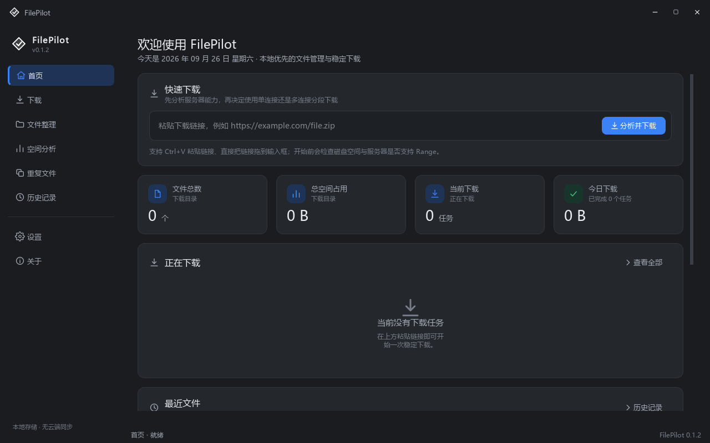
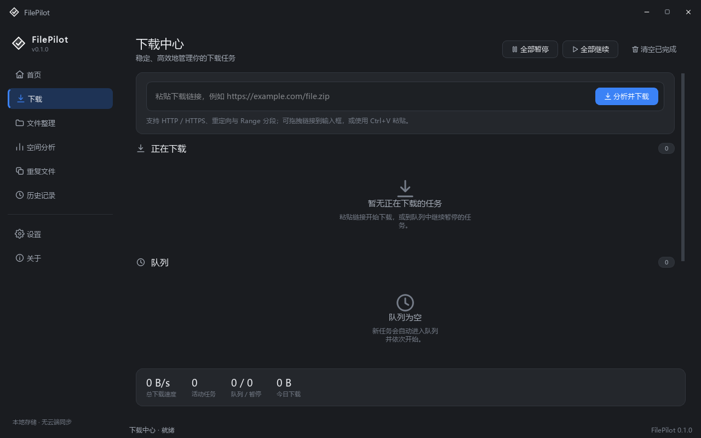
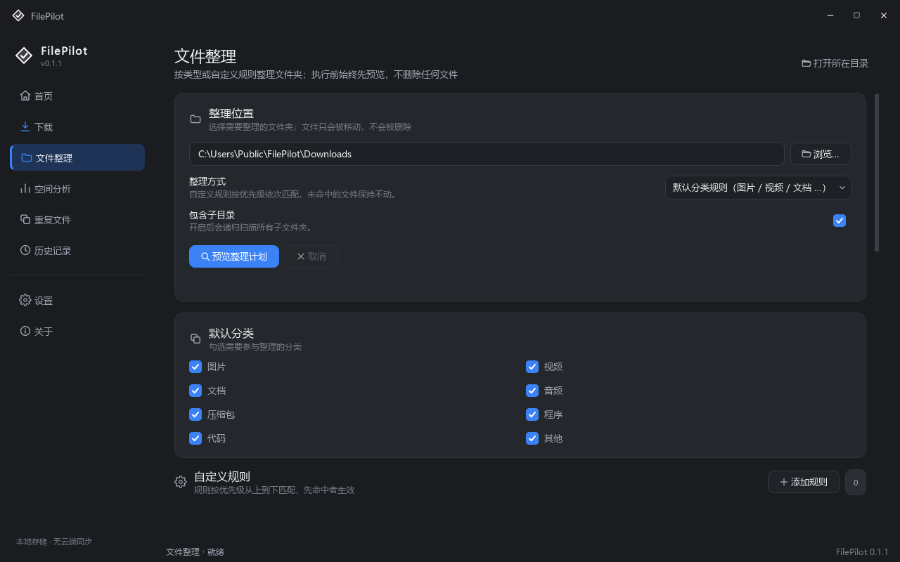
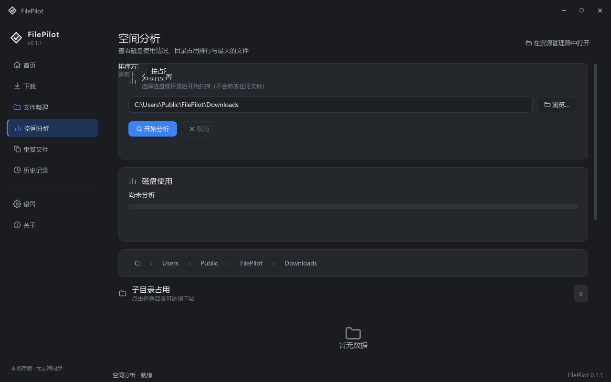
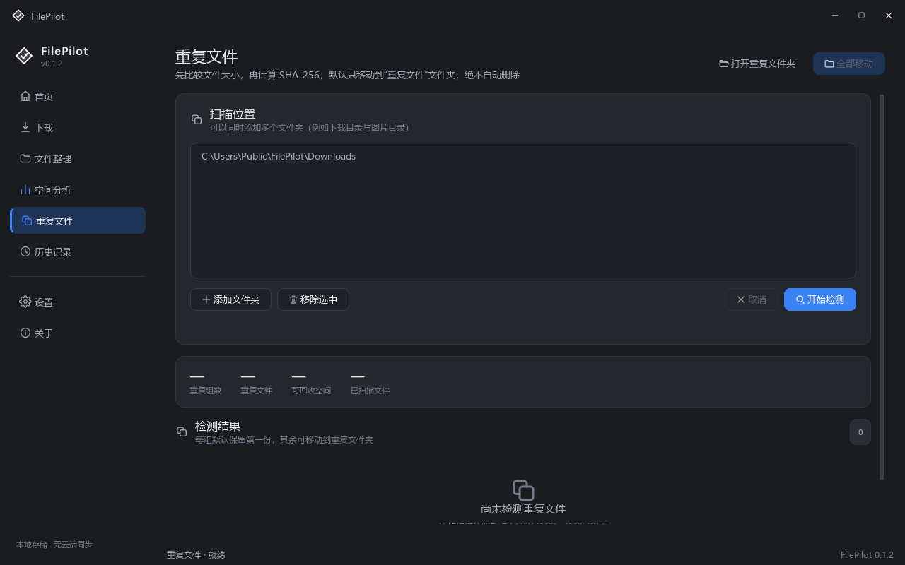
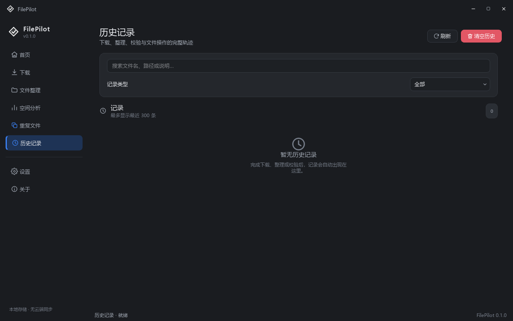
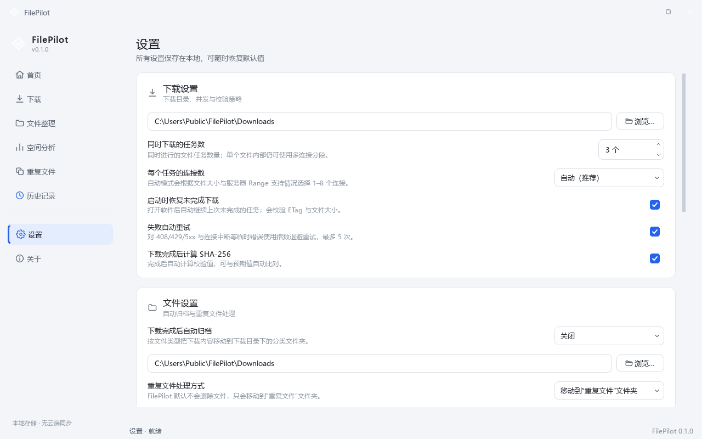
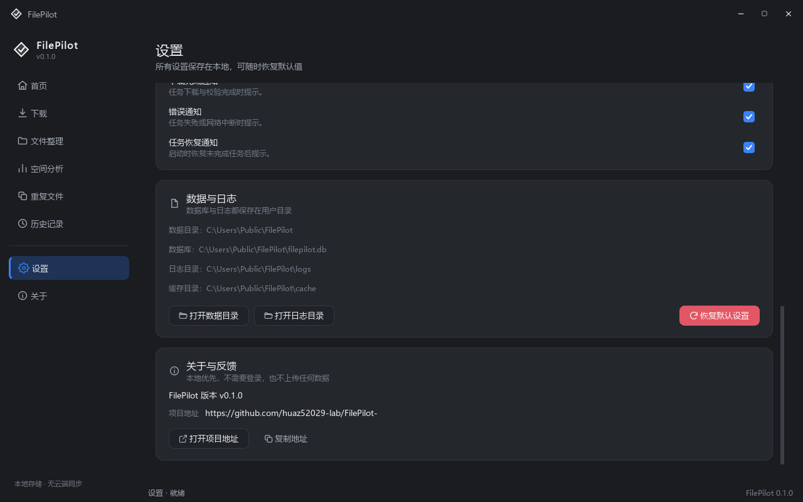

# FilePilot

**Modern Windows File Manager & Smart Download Manager**

现代化、稳定、本地优先的 Windows 文件管理与智能下载工具。下载引擎基于 `asyncio + aiohttp`，
界面基于 PySide6，数据保存在本地 SQLite，完全不依赖云端服务。

[](https://www.python.org/)
[](https://doc.qt.io/qtforpython/)
[](#)
[](#项目版本)
[](LICENSE)

- **项目地址**：<https://github.com/huaz52029-lab/FilePilot->
- **问题反馈**：<https://github.com/huaz52029-lab/FilePilot-/issues>

---

## 下载

普通 Windows 用户无需安装 Python 或任何依赖，直接下载可执行文件即可：

> 前往 **[GitHub Releases](https://github.com/huaz52029-lab/FilePilot-/releases/latest)** 下载最新 Windows 版本。

```text
Windows x64
    ↓
FilePilot-v0.1.0-Windows-x64.exe
```

| 文件 | 说明 |
| --- | --- |
| [FilePilot-v0.1.0-Windows-x64.exe](https://github.com/huaz52029-lab/FilePilot-/releases/download/v0.1.0/FilePilot-v0.1.0-Windows-x64.exe) | 单文件可执行程序（推荐，双击即用） |
| [FilePilot-v0.1.0-Windows-x64.zip](https://github.com/huaz52029-lab/FilePilot-/releases/download/v0.1.0/FilePilot-v0.1.0-Windows-x64.zip) | 便携压缩包（含 README 与 LICENSE） |

- 系统要求：Windows 10 / 11（x64）
- 数据库、配置与日志写入 `%APPDATA%\FilePilot`，不会写入程序所在目录
- 首次运行若出现 SmartScreen 提示，可选择“更多信息 → 仍要运行”（未签名开源程序的常见提示）
- 全部版本：[Releases](https://github.com/huaz52029-lab/FilePilot-/releases)

---

## 目录

- [下载](#下载)
- [Features（核心功能）](#features核心功能)
- [Screenshots（界面截图）](#screenshots界面截图)
- [快速开始](#快速开始)
- [下载流程](#下载流程)
- [Tech Stack（技术栈）](#tech-stack技术栈)
- [项目架构](#项目架构)
- [项目结构](#项目结构)
- [开发](#开发)
- [打包为 EXE](#打包为-exe)
- [使用方法](#使用方法)
- [数据与隐私](#数据与隐私)
- [FAQ](#faq)
- [已知限制](#已知限制)
- [测试](#测试)
- [项目版本](#项目版本)
- [License](#license)

---

## Features（核心功能）

| 功能 | 说明 |
| --- | --- |
| HTTP/HTTPS 下载 | 基于 `asyncio + aiohttp`，连接池与 Keep-Alive，支持重定向 |
| Range 分段下载 | 解析 `Accept-Ranges` / `Content-Range`，按分段并行下载 |
| 多连接下载 | 依据文件大小与服务器能力自动选择 1–16 个连接，并支持自适应调整 |
| 断点续传 | `*.fp.part/meta.json` + SQLite 双写，重启后校验 ETag / 大小再继续 |
| 自动重试 | 指数退避（1s→2s→4s→8s，最多 5 次），仅重试可恢复错误 |
| 智能回退 | 服务器忽略 Range 时自动切换稳定单连接，任务不失败 |
| 下载队列 | 并发任务上限可配置（默认 3），支持暂停 / 继续 / 取消 / 重试 |
| SHA-256 校验 | 完成后自动计算校验值，可与预期值比对 |
| 文件整理 | 按内置分类或自定义规则整理目录，先预览后执行，绝不覆盖 |
| 重复文件检测 | 先比大小再算 SHA-256，默认只移动到“重复文件”文件夹 |
| 空间分析 | 磁盘总览、目录下钻、最大文件与文件类型分布 |
| 下载历史 | 下载 / 整理 / 校验 / 文件操作全记录，支持搜索与清空 |
| 现代化 Windows UI | 深色优先的 Windows 11 风格中文界面，圆角卡片与统一组件 |

> 下载速度取决于你的网络、服务器带宽、CDN、链路质量与服务器限速策略。
> FilePilot 只做“智能下载 / 多连接分段 / 断点续传 / 自适应并发”，
> **不保证**对所有服务器都能加速，也不提供任何绕过网络限制的能力。

---

## Screenshots（界面截图）

### 首页（Dashboard）



### 下载中心



### 文件整理



### 空间分析



### 重复文件



### 历史记录



### 设置（浅色主题）



### 设置页底部：项目地址与版本



更多截图见 [`docs/images`](docs/images)（深色 / 浅色各 8 页）。

---

## 快速开始

### 环境要求

- Windows 10 / 11（x64）
- Python 3.13 或更高版本（开发运行需要；最终 EXE 不需要用户安装 Python）

### 安装依赖

```powershell
python -m pip install -r requirements.txt
```

### 运行

```powershell
python run_filepilot.py
# 或者
python -m app
```

### 直接使用打包好的程序

```powershell
python build.py
dist\FilePilot.exe
```

发布版本使用带版本号的产物名（同时生成便携压缩包）：

```powershell
python build.py --release --zip
# dist\FilePilot-v0.1.0-Windows-x64.exe
# dist\FilePilot-v0.1.0-Windows-x64.zip
```

---

## 下载流程

FilePilot 的下载不是“点一下就开始”，而是先分析、再决定策略、最后校验：

```text
粘贴链接
   │
   ▼
探测（HEAD → Range GET 0-0 兜底）
   ├─ 文件名 / Content-Length / Content-Type
   ├─ Accept-Ranges / Content-Range
   └─ ETag / Last-Modified
   │
   ▼
能力判断
   ├─ 支持 Range 且文件较大 ──► 多连接分段（最多 16 连接）
   ├─ 不支持 Range ─────────► 稳定单连接
   └─ 未返回文件大小 ────────► 流式单连接（不显示百分比）
   │
   ▼
下载（*.fp.part 稀疏写入 + 每 2 秒落盘进度）
   ├─ 分段失败 ──► 指数退避重试（最多 5 次）
   ├─ 服务器忽略 Range ──► 自动回退单连接（保留已完成数据）
   └─ 速度/失败率异常 ──► 自适应降低并发
   │
   ▼
收尾
   ├─ 原子改名到目标文件（同名自动 “(1)” 后缀，绝不覆盖）
   ├─ 计算 SHA-256（可选与预期值比对）
   └─ 按设置自动归档（关闭 / 按类型 / 按自定义规则）
```

### 断点续传的实现

```text
D:\Downloads\
    Ubuntu.iso                     ← 完成后原子改名到此
    Ubuntu.iso.fp.part\
        meta.json                  ← URL / ETag / Last-Modified / 分段进度
        data.part                  ← 预分配的稀疏文件，按偏移写入
```

选择“单文件稀疏写入 + 原子改名”而不是“多个分段文件再拼接”，因此：

- 不会出现“下载完成但文件仍不完整”的中间状态；
- 8 GB 文件不需要再复制一次（节省磁盘 IO 与一倍空间）。

续传时会重新探测服务器并校验大小 / ETag / Last-Modified，只要服务器上的文件发生变化，
就重新下载，避免拼出损坏的文件。

---

## Tech Stack（技术栈）

| 领域 | 选型 |
| --- | --- |
| 语言 | **Python 3.13+** |
| 界面 | **PySide6**（QWidget / QMainWindow / QStackedWidget / QThreadPool / Signal-Slot） |
| 网络 | **asyncio** + **aiohttp**（HEAD / GET / Range / Keep-Alive / 连接池 / 超时） |
| 数据库 | **SQLite**（标准库 `sqlite3`，WAL 模式，版本化迁移，无 ORM） |
| 配置 | QSettings（窗口状态）+ SQLite `settings` 表（业务设置） |
| 文件系统 | pathlib / shutil / hashlib / os / mimetypes |
| 打包 | **PyInstaller** |
| 测试 | pytest + pytest-asyncio（含本地 HTTP 服务器做真实端到端下载测试） |

---

## 项目架构

```text
Presentation Layer (app/ui)
        ↓ 只负责展示与收集输入
Application Layer (app/services)
        ↓ 任务编排、线程切换、历史记录
Domain / Core (app/core)
        ↓ 下载引擎、文件管理、纯 Python，可脱离 GUI 测试
Infrastructure (SQLite / aiohttp / 文件系统)
```

线程模型：

```text
Qt 主线程（界面、输入、渲染）
      │  Qt Signal / Slot
      ▼
DownloadService ──► DownloadBackend（桥接层）
      │  线程安全提交
      ▼
后台线程中的 asyncio 事件循环
      ▼
aiohttp 连接池 ──► 多个分段下载协程
```

关键约束（由测试保证）：

- 下载、扫描、哈希、空间分析、整理都**不在 UI 线程执行**；
- 核心层（`app/core/**`）不导入任何 Qt 模块，可单独运行与测试；
- 下载任务状态只来自真实网络请求与真实文件写入，没有模拟进度。

---

## 项目结构

```text
app/
├── main.py                      # 程序入口（含 --self-test 自检）
├── core/
│   ├── common/                  # 常量、异常、日志、路径、工具函数
│   ├── download/                # 下载引擎：探测、分段、重试、续传、调度
│   │   ├── engine.py            # 引擎门面：probe/start/pause/resume/cancel/retry/delete
│   │   ├── task.py              # 单任务执行器（分段/单连接/回退/校验）
│   │   ├── segment.py           # 分段分配器与分段下载器
│   │   ├── probe.py             # URL 探测
│   │   ├── retry.py             # 指数退避策略
│   │   ├── resume.py            # *.fp.part 与 meta.json
│   │   ├── scheduler.py         # 并发任务调度
│   │   ├── adaptive.py          # 自适应并发
│   │   └── models.py            # 领域模型
│   ├── files/                   # 扫描、整理、查重、空间分析、搜索、哈希
│   └── storage/                 # SQLite 连接、迁移、仓储
├── services/                    # 应用层：设置、下载服务、桥接、线程池
├── ui/                          # 表现层：主窗口、页面、统一组件、主题
│   ├── pages/                   # 首页/下载/整理/空间/重复/历史/设置/关于
│   ├── widgets/                 # StatCard、DownloadCard、ProgressBar、Toast…
│   └── theme.py, icons.py       # 主题令牌与 SVG 图标系统
├── resources/                   # 样式表（base/dark/light）与 SVG 图标
└── py.typed
tests/                           # 单元测试 + 真实 HTTP 端到端测试
tools/                           # 图标生成、截图、构建验证、本地测试服务器
docs/images/                     # README 截图（深色 / 浅色）
build.py                         # PyInstaller 打包脚本
run_filepilot.py                 # 开发/打包入口
```

---

## 开发

### 安装开发依赖

```powershell
python -m pip install -r requirements-dev.txt
```

### 运行测试

```powershell
python -m pytest              # 全部测试
python -m pytest -q -k download
```

测试包含一个**本地 HTTP 测试服务器**（`tests/http_server.py`），可模拟：
正确/错误 Range、忽略 Range、重定向、404、503 抖动、未知大小、慢速传输等真实场景。

### 代码检查

```powershell
python -m ruff check app tests tools
```

### 生成界面截图

```powershell
python tools/screenshot.py --out docs/images --theme dark
python tools/screenshot.py --out docs/images --theme light
```

### 本地下载测试服务器

```powershell
python tools/dev_http_server.py --port 8931 --size 64MB
# 然后在软件里下载 http://127.0.0.1:8931/file.bin
```

---

## 打包为 EXE

```powershell
python build.py            # 单文件：dist\FilePilot.exe
python build.py --onedir   # 目录模式：dist\FilePilot\FilePilot.exe（启动更快）
python build.py --console  # 保留控制台，便于排查启动问题
```

打包脚本会自动：

1. 生成多尺寸应用图标（`app/resources/icons/filepilot.ico`）；
2. 写入 Windows 版本资源信息；
3. 使用**干净的构建环境**，避免把第三方运行时目录中的同名 DLL 打进包（例如某些
   PDF/媒体工具链自带 `icuuc.dll`，一旦覆盖系统组件会导致 “DLL load failed”）；
4. 输出 `dist\FilePilot.exe`。

### 验证打包产物

```powershell
python tools/verify_build.py            # 基础自检
python tools/verify_build.py --network  # 额外验证真实 HTTP 探测
```

也可以直接运行：

```powershell
dist\FilePilot.exe --self-test
```

自检会构建全部页面、初始化数据库、启动下载引擎，并返回退出码（0 = 正常），
便于 CI 与发布前验证。

---

## 使用方法

### 下载

1. 复制下载链接，在首页或下载中心按 <kbd>Ctrl</kbd>+<kbd>V</kbd> 粘贴（也支持直接拖拽链接）；
2. 程序先分析文件信息与服务器能力；
3. 在“下载分析”对话框中确认保存目录、可选填写预期 SHA-256；
4. 点击“开始下载”，在任务卡片上查看进度、速度、ETA 与连接数；
5. 完成后自动计算 SHA-256，并按设置决定是否自动归档。

任务卡片右键菜单：暂停 / 继续 / 取消 / 重试 / 打开文件 / 打开所在目录 / 复制链接 /
复制 SHA-256 / 查看详情 / 删除任务记录。

### 文件整理

1. 选择需要整理的文件夹；
2. 选择“默认分类规则”或“自定义整理规则”（可添加规则并设置优先级）；
3. 点击“预览整理计划”，查看每个文件的去向与冲突；
4. 确认无误后点击“确认整理”。同名文件自动跳过，**不会覆盖，也不会删除**。

### 重复文件

添加若干扫描目录 → 开始检测（先比大小再算 SHA-256）→ 每组默认保留第一份，
其余可一键移动到“重复文件”文件夹（原文件可随时还原）。

### 空间分析

选择磁盘或目录 → 开始分析 → 查看子目录排行、最大文件与类型分布，
点击任意子目录可继续下钻。

---

## 数据与隐私

所有数据都在本机，不上传任何信息：

```text
%APPDATA%\FilePilot\
    filepilot.db          # 任务、历史、规则、设置
    logs\YYYY-MM-DD.log   # 按天切分的运行日志
    cache\                # 预留缓存目录
```

可通过环境变量 `FILEPILOT_HOME` 覆盖数据目录（便携模式 / 测试隔离）。
程序**不会**把数据库或日志写入安装目录。

设置页与关于页都提供“打开数据目录 / 打开日志目录”按钮。
界面只展示自然语言错误提示，完整 traceback 仅写入日志。

---

## FAQ

**Q：下载速度为什么没有明显提升？**
A：多连接只在服务器支持 `Accept-Ranges` 且没有针对单 IP 限速时才有收益。
任务卡片会显示 `Range ✓/✕`；若服务器不支持，程序会自动使用稳定的单连接模式。

**Q：暂停后重启程序，任务会继续吗？**
A：会。默认开启“启动时恢复未完成下载”，程序会校验大小与 ETag 后继续下载。
可在设置中关闭。

**Q：服务器上没有 `Content-Length` 怎么办？**
A：程序使用流式单连接下载，此时无法显示百分比与 ETA（这是服务器信息缺失导致的，
不是界面缺陷）。

**Q：会覆盖同名文件吗？**
A：不会。目标目录已存在同名文件时自动生成 `文件名 (1).扩展名`。

**Q：会删除我的文件吗？**
A：不会自动删除。整理只移动；重复文件默认移动到“重复文件”文件夹；
删除操作只针对任务记录与未完成的临时文件，并且都需要确认。

**Q：日志在哪里？**
A：`%APPDATA%\FilePilot\logs\`，或在“设置 → 数据与日志”中点击“打开日志目录”。

---

## 已知限制

- 下载速度受用户网络、服务器带宽、CDN 与限速策略影响，无法保证加速效果；
- 服务器未提供 `Content-Length` 时无法显示百分比与 ETA；
- 断点续传依赖服务器提供 `ETag` 或 `Last-Modified` 以校验文件是否变化；
- 部分需要登录 / 携带 Cookie 的直链无法直接下载（会给出明确提示）；
- 跨分区自动归档会退化为“复制 + 删除源文件”，大文件耗时较长；
- 当前界面语言为简体中文。

---

## 测试

覆盖范围（`python -m pytest`）：

| 分类 | 内容 |
| --- | --- |
| 下载 | 小文件、大文件分段、HTTPS/HTTP 探测、重定向、404、Range 支持/不支持/错误返回、服务器忽略 Range 自动回退、自动重试、暂停/继续、程序重启恢复、同名文件、磁盘空间不足、SHA-256 校验、删除任务、队列并发上限 |
| 界面 | 主题令牌完整性、页面切换、侧边栏、主题切换、Toast、探测失败提示、GUI↔引擎跨线程集成、程序入口启动与退出 |
| 文件 | 扫描与取消、空间统计、目录占用递归、整理计划与执行、同名冲突、规则匹配、自动归档、重复文件检测与移动、搜索与高级语法解析 |
| 基础 | 数据库迁移、仓储读写、事务回滚、工具函数、分段模型、速度计量、异常文案 |

---

## 项目版本

当前版本：**v0.1.0**

| 位置 | 值 |
| --- | --- |
| 软件版本（`app/core/common/constants.py` 的 `APP_VERSION`） | `0.1.0` |
| 打包元数据（`pyproject.toml` 的 `project.version`） | `0.1.0` |
| 关于页面 / 设置页面 | 读取 `APP_VERSION`，显示 `v0.1.0` |
| Windows EXE 版本资源 | 打包时写入 `0.1.0` |
| 更新日志 | [CHANGELOG.md](CHANGELOG.md) |

---

## License

[MIT License](LICENSE) © 2026 FilePilot Contributors
